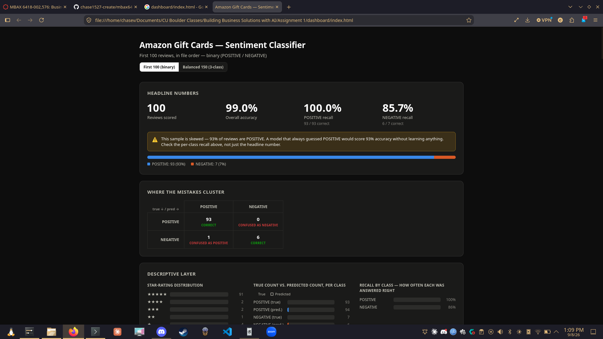
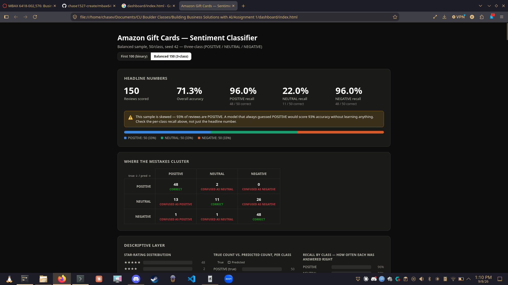

# Amazon Gift Cards Review — Sentiment & Emotion Classification

MBAX 6418, Assignment 1. A working classifier for Amazon Gift Cards reviews: sentiment
(binary, then three-class), scored against the star rating; primary emotion, detected two
independent ways; and a results dashboard tying it all together.

> **Draft note:** this report was generated with an agent (Claude Code) — it wrote the
> narrative and pulled every number below from the saved run files. Per the assignment,
> it's still my deliverable: I reviewed it, checked the numbers against `runs/*.json`
> myself, and the framing below is what I'd say, not just what the agent drafted.

## Data

[Amazon Reviews '23](https://amazon-reviews-2023.github.io) (McAuley Lab, UC San Diego),
**Gift Cards** category — 152,410 reviews, gzipped JSON Lines. Not committed to this repo
(large, and re-downloadable from the source); see `scripts/data.py` for how it's read.

## Repo layout

| File | What it is |
|---|---|
| `scripts/prompt.py` | The classification prompts — binary (Step 1) and three-class (Step 6), plus the emotion extension (Step 5) |
| `scripts/classify_batch.py` | Scores the first 100 reviews (in file order) against the rating — Step 2 |
| `scripts/classify_balanced.py` | Builds the fixed-seed, 50/class balanced sample and scores it three-class — Step 6 |
| `scripts/nrc_emotion.py` | Word-list emotion scoring against the NRC lexicon — no model calls — Step 5 |
| `scripts/add_emotions.py` | Adds both emotion methods to a saved run and compares them — Step 5 |
| `scripts/generate_dashboard.py` | The dashboard generator — injects `runs/*.json` into `dashboard/template.html` |
| `dashboard/index.html` | The final dashboard — self-contained, works offline, no server needed |
| `runs/batch100.json` | Raw output: the first-100 binary run (with emotion enrichment) |
| `runs/balanced150.json` | Raw output: the balanced 150-review three-class run |
| `data/nrc_lexicon.json` | Vendored NRC Word-Emotion Association Lexicon (word → emotions) |

## Reproducing this

```
python3 -m venv .venv && ./.venv/bin/pip install -r requirements.txt
cp .env.example .env   # fill in your OpenAI-compatible endpoint + key
cd scripts
python3 classify_batch.py 100 batch100.json
python3 add_emotions.py batch100.json
python3 classify_balanced.py balanced150.json
python3 generate_dashboard.py
```

`classify_balanced.py` uses a fixed random seed (42) over the *whole* dataset, so it pulls
the same 150 reviews every time — see "reproducibility" note below.

## Results

### Binary, first 100 reviews (Step 2)

| | |
|---|---|
| Accuracy | **99%** (99/100) |
| True split | 93 POSITIVE / 7 NEGATIVE |
| POSITIVE recall | 100% (93/93) |
| NEGATIVE recall | 85.7% (6/7) |

### Three-class, balanced sample (Step 6)

50 reviews per class, pulled with a fixed seed from all 152,410 reviews (not the first N —
see Q1 below for why that matters).

| | |
|---|---|
| Accuracy | **71.3%** (107/150) |
| POSITIVE recall | 96% (48/50) |
| NEUTRAL recall | **22%** (11/50) |
| NEGATIVE recall | 96% (48/50) |

Confusion matrix (rows = true, columns = predicted):

| True \ Predicted | POSITIVE | NEUTRAL | NEGATIVE |
|---|---|---|---|
| **POSITIVE** | 48 | 2 | 0 |
| **NEUTRAL** | 13 | 11 | 26 |
| **NEGATIVE** | 1 | 1 | 48 |

### Emotion: LLM vs. NRC word list (Step 5, on the 100-row binary set)

| | |
|---|---|
| Reviews where both methods gave an answer | 85 / 100 (15 had no lexicon words at all) |
| Agreement | **23.5%** (20 / 85) |
| LLM's top emotion | joy — 89/100 reviews |
| Word list's top emotion | anticipation — 59/100 reviews |

## Screenshots

**First 100, binary run:**



**Balanced 150, three-class run:**



## Answers

### 1. Why did the lopsided run look very accurate, and what did sampling equal amounts of each class change?

The first-100 batch is 93% POSITIVE by chance of file order, so a model that *always*
guessed POSITIVE would already score 93% accuracy without learning anything. The actual
model scored 99% — only 6 points better than that trivial baseline — but the number "99%
accuracy" on its own hides that almost the entire test was the easy class.

Pulling all 152,410 reviews and checking the true rating distribution makes this explicit:
**88.5% POSITIVE, 9.3% NEGATIVE, 2.1% NEUTRAL**. Three-star reviews are genuinely rare —
about 1 in 47 — so reading the first N rows in file order would almost never surface one.
Once the sample is rebalanced to 50/class, accuracy drops to 71.3%, and the drop is
entirely attributable to one class: POSITIVE and NEGATIVE recall barely moved (96% each,
versus 100%/85.7% on the skewed sample), but NEUTRAL recall is only 22%. The skewed run
wasn't measuring the model's real performance — it was measuring performance on the one
class the model is already good at, weighted by how often that class happens to occur.

### 2. Where do the model's mistakes go — which classes get confused with which, and in what direction?

From the balanced-sample confusion matrix above: of 50 true NEUTRAL (3-star) reviews, only
11 were correctly called NEUTRAL. **26 were called NEGATIVE and 13 were called POSITIVE** —
so NEUTRAL fails toward NEGATIVE roughly twice as often as it fails toward POSITIVE.

The reverse direction is much rarer: of 50 true NEGATIVE reviews, only 1 was called NEUTRAL
(and 1 POSITIVE) — NEGATIVE recall is 96%. So the confusion isn't symmetric "NEUTRAL and
NEGATIVE get mixed up with each other" — it's specifically that **lukewarm reviews read to
the model as bad, far more than bad reviews read as lukewarm**. A 3-star review with a real
but minor complaint tends to get judged the same as a 1-star review with a serious one.

### 3. How do the LLM's emotions and the word list's emotions differ, and why?

They agree only 23.5% of the time, and the disagreement has a specific, traceable cause
rather than being generic noise. The LLM calls 89/100 reviews "joy" — a reasonable read,
since these are mostly satisfied gift-card reviews. The word list calls only 21/100 "joy"
and instead calls 59/100 "anticipation."

Looking at the actual NRC lexicon entries explains why: common words in this dataset —
**"gift," "money," "good," "present," "birthday"** — are tagged with *both* `anticipation`
and `joy` simultaneously (along with `positive`, `surprise`, `trust` in most cases). Since
almost every gift-card review contains one of these words, both emotion scores climb
together and tie constantly. My word-list scorer breaks ties alphabetically, and
"anticipation" comes before "joy" — so nearly every tie resolves to anticipation. This
isn't the word list detecting a different *emotion* in the text; it's a structural artifact
of (a) the lexicon tagging common domain words with multiple emotions at once, and (b) an
arbitrary tie-break rule that happens to favor one of them. Looking at where the LLM said
"joy" specifically: of the 74 such reviews the word list could also score, it called 51 of
them "anticipation," 20 "joy," and the rest something else — a direct look at the same
mechanism.

### 4. What bugs and issues came up, and how were they worked around?

- **A silent truncation crash.** One review's emotion call returned `content=None`
  (the model hadn't finished by the token cap), and the fallback text-parser crashed with
  an unhelpful `'NoneType' object has no attribute 'upper'` instead of a clear error.
  Fixed with an explicit empty-content guard that raises a readable `ValueError`.
- **The same review kept failing after that fix.** Reproducing it directly showed the
  model reliably burns 500+ tokens of internal reasoning on this one review before
  answering — and, more surprisingly, that exact length wasn't perfectly stable
  run-to-run at `temperature=0` (a known effect of floating-point non-determinism under
  continuous batching on a shared, multi-tenant inference server). The fix was a taller
  retry ladder (300 → 900 → 3,600 tokens) rather than special-casing one review, since the
  underlying cause — a small number of reviews needing much more reasoning room than
  average — could hit any review, not just this one.
- **A confusing zero-width-bar risk in the dashboard.** Rather than debug that failure
  mode after the fact, the descriptive-layer bar charts (Step 7) were built from the start
  on a CSS Grid layout with fixed-width label and count columns and a flexible middle
  track — a pattern that structurally can't let a text label consume a bar's width down to
  zero, which is the specific bug the assignment calls out.
- **A minor ordinal-color contrast bug**, caught before shipping: the star-rating bars
  initially reused a sequential color ramp whose lightest steps are nearly invisible on
  the light background. Switched to a ramp that clears the 2:1 contrast floor for ordinal
  data.
- **Re-running the emotion enrichment pass** was originally all-or-nothing — fixing one
  failed record meant re-calling the model on all 100. Made it resumable (skip records
  already enriched successfully) so a partial failure costs one retry, not a full re-run.

## What's not in this repo, and why

- `Gift_Cards.jsonl.gz` — large (12MB) and re-downloadable from the source above.
- `.env` — holds the API endpoint/key; `.env.example` documents the shape.
- The assignment PDF — instructor's course material, not appropriate for a public repo.

## Reproducibility

Every number above comes from a fixed choice of data and settings: `classify_batch.py`
reads the first N rows in a fixed file; `classify_balanced.py` samples with
`random.Random(42)` over the full dataset; every model call uses `temperature=0`. Re-running
the scripts should reproduce the same reviews and (with the caveat in the bugs section
above) the same predictions.
